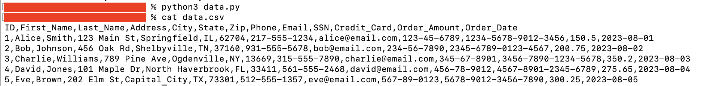
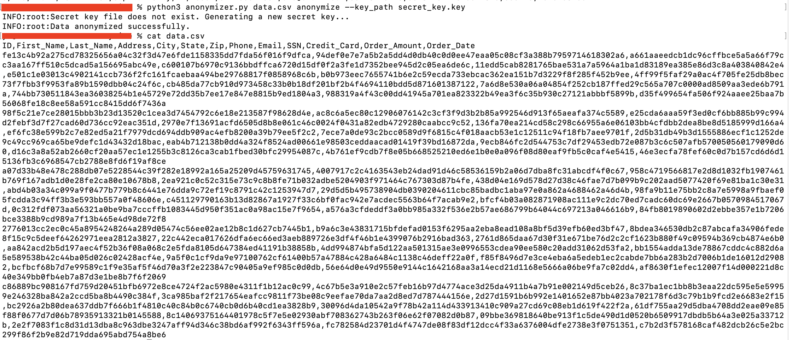
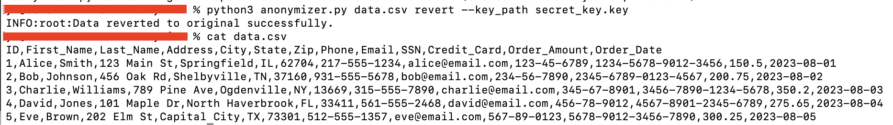

# Data Anonymizer

Anonymize sensitive data in your datasets. It generates pseudonyms for specified columns in a CSV file using a salted SHA-256 hashing function. Integrity checks with HMAC. The script allows for reverting the data back to its original form using encrypted mapping files that are generated during the anonymization process.

## How It Works

- Load or Generate Secret Key (if not exist)
- Process Input Data File
- Data Pseudonymization or Reversion
- Encrypted Mapping Files
  - During the 'anonymize' operation, for each specified column, the script creates an encrypted file that maps the pseudonyms back to the original data.
  - These mapping files are encrypted using the Fernet symmetric encryption scheme, and an HMAC is appended to ensure data integrity.
- Data Integrity
  - When reverting data, the script first checks the integrity of the encrypted mapping files by comparing a stored HMAC with a computed HMAC.
- Output

## Install dependencies

```bash
pip3 install -r requirements.txt
```

## How to Use

```bash
python3 anonymizer.py file_path operation --cols column_names --key_path secret_key_path
```
- file_path: Path to the data file (CSV format)
- operation: 'anonymize' or 'revert'
- --cols: Specific columns to anonymize or revert (default is all columns)
- --key_path: Path to the secret key file (required)

## Usage Example

1. Generate a data example

```bash
python3 data.py
```


3. Anonymize

```bash
python3 anonymizer.py data.csv anonymize --key_path secret_key.key
```



3. Revert

```bash
python3 anonymizer.py data.csv revert --key_path secret_key.key
```



